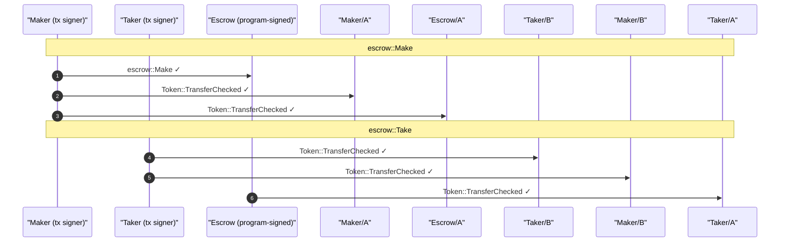
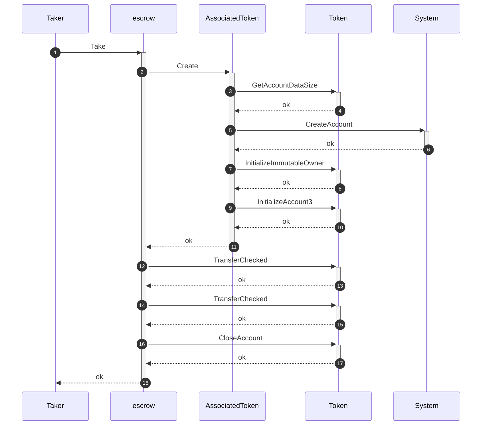

# Escrow: Trustless Token Exchange
## See also

- [`docs/testing/derive-scaffolding.md`](docs/testing/derive-scaffolding.md): the bundle/derive deep dive.

A maker offers Token A for Token B. The maker locks A into a vault; a taker later
pays B and takes A, in one atomic transaction. Nobody is trusted with custody,
and the reason is a single authority fact: **the maker and taker sign their own
payments, but only the escrow program can release the vault.**

Here is that custody model, generated from a passing test (not drawn by hand),
across the two-instruction `make` then `take` lifecycle:



Read the arrows by where they *start*. Every inbound payment leaves a human's
lane: the maker's signature funds the vault (`Escrow/A`), the taker's pays the
maker (`Maker/B`). 

The one release that matters, paying the vault's Token A out to the taker,
leaves the **`Escrow` PDA's** lane: the program signs it via `invoke_signed`,
and only inside a `take` that also pays the maker. That is what "trustless"
means here, made mechanical. 

A plain CPI trace cannot show it (every transfer looks identical in the call
graph); the diagram is recovered from execution by my modified
`anchor-litesvm`, the test framework this repo exists to exercise.

The same harness renders the *control-flow* view, a full-duplex sequence diagram
with call/return lifelines. Here is the `take`, the atomic settlement, where the
program creates the destination accounts, runs both transfers, and closes the
vault, each call activating and returning before the next:



Two lenses on one execution, both generated: which authority caused each write,
and what called what in which order. ([Trimmed: the real `take` also creates the
maker's Token A account; full record in [`docs/testing/test-report.md`](docs/testing/test-report.md).])

## The program in one breath

Three instructions, two actors, no trusted operator.

| Instruction | What it does                                                            |
| ----------- | ----------------------------------------------------------------------- |
| `make`      | maker opens an escrow, locks Token A into a vault owned by the escrow PDA |
| `take`      | taker pays Token B to the maker, receives the vault's A, vault closes (atomic) |
| `refund`    | after expiry, the maker recovers the locked A and closes the escrow     |

The escrow state PDA stores the trade (`maker`, `mint_a`, `mint_b`, `receive`,
`expiry`, `bump`); the vault is its associated token account for mint A, with
authority assigned to the PDA. PDA seed: `escrow = ["escrow", maker, seed]`.

## How you get that

Everything above the fold is emitted by a test you write in about a dozen lines,
and the model is theatrical: a trace has a *cast*, a *stage*, and *scenes*.

- **Roles** belong to the program. Each instruction's `#[derive(Accounts)]`
  names the parts, a `maker`, a `taker`, the `escrow` authority; the program's
  author casts them.
- **Actors** are the keypairs you give those roles. `ActorRegistry` mints them
  deterministically (the same Maker on every run, uniqueness-checked), and an
  `EscrowBundle` assigns actors to roles by field name, so building the bundle
  is the casting call.
- **The stage** is the in-process SVM (`AnchorContext`): deploy the program,
  mint the tokens, and the cast acts with no validator and no RPC.
- **Scenes** are the sends. `ctx.tx(&[&maker]).build(bundle, args).send_ok()` is
  one beat of the play.

You write the play; the harness writes the review. Every account in the diagrams
above reads in **domain terms**, `Maker`, `Escrow`, `Maker/A`, never a base58
key, because the `ActorRegistry` names the leaves and `ctx.alias_ata` composes
each token account's name (`<holder>/<mint>`) from them. A `Report` collects the
run into the committed [`test-report.md`](docs/testing/test-report.md).

## Watch one test

The take scenario runs the full lifecycle, the maker opens, the clock advances
to the last day of the window, the taker settles, and records it as a
committable, diffable report. Because the identities are seeded, the report is
byte-stable: a change in its diff is a change in behavior.

**→ [`docs/testing/test-report.md`](docs/testing/test-report.md)** carries the
before/after token balances as pass/fail checks, the authority diagram, and the
**account index**, the standing structure of every account the swap touched,
classified by owner and authority, recovered from the trace:

```text
Maker  (human signer, owned by System)
  ├── Maker/A  (ATA · mint A)
  └── Maker/B  (ATA · mint B)
Taker  (human signer, owned by System)
  ├── Taker/A  (ATA · mint A)
  └── Taker/B  (ATA · mint B)
Escrow  (program-signed, owned by escrow)
  └── Escrow/A  (ATA · mint A)
A / B  (the mints, owned by Token)

── programs ──
System  (owns Maker, Taker)
Token   (owns every token account)
escrow  (owns Escrow)
AssociatedToken  (derived 5 ATA edges)
```

The vault is `Escrow/A`: the escrow PDA's associated token account for mint A.
The index nests it under `Escrow`, owned by the Token program but signed for by
the escrow program, which is exactly the custody arrangement the authority
diagram draws.

<details>
<summary><strong>The same <code>take</code>, raw logs vs structured tree</strong></summary>

What Solana emits (left, trimmed: the real stream runs ~45 lines) and what
`anchor-litesvm` folds it into (right), for the identical transaction:

<table>
<tr><th align="left">Raw Solana logs (excerpt)</th><th align="left">anchor-litesvm structured</th></tr>
<tr valign="top">
<td><pre>
Program H1Gj…rH9o invoke [1]
Program log: Instruction: Take
Program AToken…A8knL invoke [2]
Program log: Create
Program Tokenkeg…5DA invoke [3]
Program Tokenkeg…5DA success
Program 1111…1111 invoke [3]
…
Program Tokenkeg…5DA invoke [2]
Program Tokenkeg…5DA success
Program H1Gj…rH9o consumed 87972 of 200000
Program H1Gj…rH9o success
</pre></td>
<td><pre>
── escrow::Take ────────────
Transaction  signers=[Taker]
└── escrow::Take [1] ✓ 87972cu  signer=Taker
    ├── AssociatedToken::Create [2] ✓ 20916cu
    │   └── (init the taker's mint-A account)
    ├── AssociatedToken::Create [2] ✓ 13517cu
    │   └── (init the maker's mint-B account)
    ├── Token::TransferChecked [2] ✓ 105cu
    ├── Token::TransferChecked [2] ✓ 105cu
    └── Token::CloseAccount [2] ✓ 118cu

Legend:
  escrow = H1Gj…rH9o
  Taker  = E2Zk…X9gM
</pre></td>
</tr>
</table>

The flat stream is all base58 with the inner CPIs as anonymous `invoke [2]` /
`invoke [3]` markers; the structured tree names each program and instruction,
nests the CPIs to their real depth, and attributes the top-level signer. The
lifelines and authority diagrams above are derived from that same tree.
</details>

## Run it

```sh
just t        # build + run the suite
just tt       # same, with --nocapture: structured CPI tree + lifelines per ix
just test-md  # regenerate docs/testing/test-report.md
```

The suite uses the experimental `anchor-litesvm`'s `Report` recorder and `ActorRegistry`
identities. See [derive-scaffolding doc](docs/testing/derive-scaffolding.md) for the deep dive
on the bundle machinery.

The suite covers all three instructions across the scenarios: `make` (create +
wrong-PDA), `take` (settle at the day-89 expiry boundary, reject after expiry,
reject a wrong vault), and `refund` (recover after expiry, reject before expiry,
reject a wrong maker).

---

<details>
<summary><strong>Architecture: control plane vs asset plane</strong></summary>

The program splits into two planes.

**Control plane** coordinates execution, authority validation, the escrow
lifecycle, and PDA signing for vault operations. Its anchor is the **Escrow
PDA + state account**: the state stores the trade configuration (which assets,
who created it, how much Token B is required, the vault), and the PDA acts as
the escrow authority, signing the vault release with its seeds during `take`
and `refund`.

The escrow state account carries:

| Field     | Purpose                                       |
| --------- | --------------------------------------------- |
| `seed`    | Distinguishes multiple escrows from one maker |
| `maker`   | Creator of the escrow                         |
| `mint_a`  | Token being offered                           |
| `mint_b`  | Token requested in return                     |
| `receive` | Amount of Token B expected                    |
| `expiry`  | Unix timestamp; `take` fails after this time  |
| `bump`    | PDA bump seed                                 |

**Asset plane** holds the token balances: the **vault ATA** (the escrow PDA's
associated token account for mint A), which temporarily escrows Token A. Its
authority is the escrow PDA, so only the program can authorize the release of A,
and only when the trade conditions are satisfied.

```mermaid
sequenceDiagram
    autonumber

    actor Maker
    participant Program as Escrow Program<br/>(Control Plane)
    participant Escrow as Escrow PDA + State<br/>(Control Plane)
    participant Vault as Vault ATA<br/>(Asset Plane)<br/>authority = Escrow PDA
    actor Taker

    Note over Maker: owns Token A
    Note over Taker: owns Token B

    rect rgba(30, 64, 175, 0.18)
    Note over Maker,Vault: make instruction — invoked by Maker
    Maker->>Program: invoke make
    Program->>Escrow: initialize escrow state<br/>(seed, maker, mint_a, mint_b, receive, bump)
    Program->>Vault: deposit Token A<br/>(CPI to Token Program, signed by Maker)
    end

    rect rgba(22, 101, 52, 0.20)
    Note over Maker,Taker: take instruction — invoked by Taker<br/>(single atomic transaction)
    Taker->>Program: invoke take
    Note over Program: both transfers execute atomically;<br/>if either CPI fails, the whole transaction reverts
    Program->>Maker: transfer Token B to Maker<br/>(CPI signed by Taker)
    Program->>Escrow: sign vault release<br/>(PDA signer seeds)
    Escrow->>Vault: authorize Token A withdrawal
    Vault->>Taker: transfer Token A to Taker
    Program->>Escrow: close vault and escrow state<br/>refund rent to Maker
    end
```

</details>

