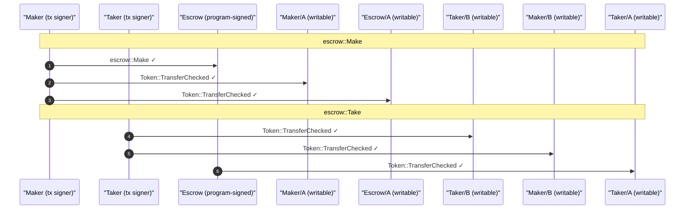

<!-- GENERATED by `just test-md`; do not edit by hand. -->
# Escrow Test Report

One section per integration-test scenario, emitted by the `Report`
recorder and concatenated in sorted order. Regenerate with `just test-md`.

## Escrow: make creates the escrow and funds the vault — PASS

> The maker opens an escrow offering `deposit` of mint_a in exchange for `receive` of mint_b. `make` records the terms in the escrow account and moves the full deposit from the maker's source ATA into the vault (an ATA owned by the escrow PDA).

### Before: maker holds the deposit, vault does not exist yet

**balances**

| account | amount |
|---|---|
| Maker mint_a | 1000000 |
| Maker mint_b | — |
| Taker mint_a | — |
| Taker mint_b | 2000000000 |
| Vault mint_a | — |

### Action: maker calls make(seed, receive, deposit)

### After: escrow records the terms; the deposit sits in the vault

**balances**

| account | amount |
|---|---|
| Maker mint_a | 0 |
| Maker mint_b | — |
| Taker mint_a | — |
| Taker mint_b | 2000000000 |
| Vault mint_a | 1000000 |

- [x] escrow.seed: `42`
- [x] escrow.maker: `yUt2uGHDQTGniin6H4ickJPe5UAWbnE68MVy58Mx4ea`
- [x] escrow.mint_a: `6R34wogoFcDwNkDQHaGiEJiZTowZM3mnz7JkkL7MfYsG`
- [x] escrow.mint_b: `4DLjnMkzytDCSTCyWS8axTgaDDkb9TX6i3UYwdURktfQ`
- [x] escrow.receive: `2000000000`
- [x] vault holds the deposit: `Some(1000000)`
- [x] maker source drained: `Some(0)`

---

## Escrow: make rejects a wrong escrow PDA — PASS

> The escrow account is constrained by `seeds = [b"escrow", maker, seed]`. Substituting an unrelated pubkey for the escrow account must fail the seeds check (ConstraintSeeds) with nothing else touched.

### Action: maker calls make but the escrow account is the wrong PDA

**rejection logs**

```console

── escrow::Make ────────────────────────────────────────────
Transaction  signers=[Maker]
└── escrow::Make [1] ✗ 9498cu  signer=Maker
    └── Error: ConstraintSeeds
Error: InstructionError(0, Custom(2006))
Compute Units (this run): 9498
Fee: 5000 lamports
Legend (2):
  escrow = H1GjRKWSauAuupurDtGiY5uvhLBtUngNhvrSBs75rH9o
  Maker  = yUt2uGHDQTGniin6H4ickJPe5UAWbnE68MVy58Mx4ea
```

### After: nothing moved; the maker still holds the deposit

**balances**

| account | amount |
|---|---|
| Maker mint_a | 1000000 |
| Maker mint_b | — |
| Taker mint_a | — |
| Taker mint_b | 2000000000 |
| Vault mint_a | — |

- [x] maker still holds the deposit: `Some(1000000)`

---

## Escrow: refund is rejected before expiry — PASS

> refund is the mirror of take's gate: allowed only after the window closes. Inside the window it must fail with EscrowNotExpired, so a maker cannot yank the deposit out from under a taker who is mid-flight.

### Setup: maker opens the escrow

### Advance only 19 days (comfortably inside the 90-day window)

### Action: maker calls refund while still live → must fail

**rejection logs**

```console

── escrow::Refund ──────────────────────────────────────────
Transaction  signers=[Maker]
└── escrow::Refund [1] ✗ 11860cu  signer=Maker
    └── Error: EscrowNotExpired
Error: InstructionError(0, Custom(6001))
Compute Units (this run): 11860
Fee: 5000 lamports
Legend (2):
  escrow = H1GjRKWSauAuupurDtGiY5uvhLBtUngNhvrSBs75rH9o
  Maker  = yUt2uGHDQTGniin6H4ickJPe5UAWbnE68MVy58Mx4ea
```

### After: the deposit is still escrowed

**balances**

| account | amount |
|---|---|
| Maker mint_a | 0 |
| Maker mint_b | — |
| Taker mint_a | — |
| Taker mint_b | 2000000000 |
| Vault mint_a | 1000000 |

- [x] vault still holds the deposit: `Some(1000000)`
- [x] escrow account still open: `true`

---

## Escrow: refund reads only its slice of the shared bundle — PASS

> The ten-field EscrowBundle is shared across make/take/refund, but each instruction's generated `From<EscrowBundle>` projects only the fields it names. refund touches just maker/mint_a/maker_ata_a/escrow/vault, so a bundle that pins those and leaves the five taker-side fields as `..EscrowBundle::default()` placeholders still settles the refund: the ergonomic that `#[derive(Bundle)]`'s Default buys.

### Setup: maker opens the escrow with the full bundle, then it expires

### Action: refund with a bundle whose taker-side fields are placeholders

Only maker/mint_a/maker_ata_a/escrow/vault are pinned; the other five are fresh `Pubkey::new_unique()` values from Bundle's Default, and refund never looks at them.

### After: refund settled exactly as it would with the full bundle

**after refund**

| account | amount |
|---|---|
| Maker mint_a | 1000000 |
| Maker mint_b | — |
| Taker mint_a | — |
| Taker mint_b | 2000000000 |
| Vault mint_a | — |

- [x] maker recovered the deposit: `Some(1000000)`
- [x] vault account closed: `false`
- [x] escrow account closed: `false`

---

## Escrow: refund rejects a wrong maker account — PASS

> Even past expiry, refund must pay the *right* maker. Swapping an unrelated pubkey into the `maker` slot (while the real maker still signs as fee payer) fails ConstraintTokenOwner: maker_ata_a's owner no longer matches the passed maker.

### Setup: maker opens the escrow, then the window expires

### Action: refund with the maker slot pointed at an unrelated pubkey → must fail

**rejection logs**

```console

── escrow::Refund ──────────────────────────────────────────
Transaction  signers=[Maker]
└── escrow::Refund [1] ✗ 7552cu
    └── Error: ConstraintTokenOwner
Error: InstructionError(0, Custom(2015))
Compute Units (this run): 7552
Fee: 5000 lamports
Legend (2):
  escrow = H1GjRKWSauAuupurDtGiY5uvhLBtUngNhvrSBs75rH9o
  Maker  = yUt2uGHDQTGniin6H4ickJPe5UAWbnE68MVy58Mx4ea
```

### After: the real escrow and vault are intact

- [x] vault still holds the deposit: `Some(1000000)`
- [x] escrow account still open: `true`

---

## Escrow: refund returns the deposit after expiry and closes the escrow — PASS

> When no taker shows up before the 90-day window closes, the maker recovers: refund (allowed only once expired) returns the vault's full mint_a to the maker and closes the vault + escrow (rent back to the maker).

### Setup: maker opens the escrow (deposit now in the vault)

**after make**

| account | amount |
|---|---|
| Maker mint_a | 0 |
| Maker mint_b | — |
| Taker mint_a | — |
| Taker mint_b | 2000000000 |
| Vault mint_a | 1000000 |

### Advance 199 days (past the 90-day window, so refund is allowed)

### Action: maker calls refund

refund declares no Signer; the maker signs only as the transaction fee payer.

### After: deposit back with the maker; vault + escrow closed

**after refund**

| account | amount |
|---|---|
| Maker mint_a | 1000000 |
| Maker mint_b | — |
| Taker mint_a | — |
| Taker mint_b | 2000000000 |
| Vault mint_a | — |

- [x] maker recovered the deposit: `Some(1000000)`
- [x] vault account closed: `false`
- [x] escrow account closed: `false`

---

## Escrow: take is rejected after the escrow expires — PASS

> Past the 90-day window the offer is dead: take must fail with EscrowExpired (not a generic constraint error), so a refactor that still rejects but for the wrong reason is caught. After expiry the maker's path is refund, not a taker's take.

### Setup: maker opens the escrow

### Advance 199 days (definitely past the 90-day window)

### Action: taker calls take on the expired escrow → must fail

**rejection logs**

```console

── escrow::Take ────────────────────────────────────────────
Transaction  signers=[Taker]
└── escrow::Take [1] ✗ 79772cu  signer=Taker
    ├── AssociatedToken::Create [2] ✓ 20916cu
    │   ├── Token::GetAccountDataSize [3] ✓ 183cu
    │   ├── System::CreateAccount [3] ✓ (no cu)
    │   ├── Token::InitializeImmutableOwner [3] ✓ 38cu
    │   └── Token::InitializeAccount3 [3] ✓ 235cu
    ├── AssociatedToken::Create [2] ✓ 13517cu
    │   ├── Token::GetAccountDataSize [3] ✓ 183cu
    │   ├── System::CreateAccount [3] ✓ (no cu)
    │   ├── Token::InitializeImmutableOwner [3] ✓ 38cu
    │   └── Token::InitializeAccount3 [3] ✓ 235cu
    └── Error: EscrowExpired
Error: InstructionError(0, Custom(6000))
Compute Units (this run): 79772
Fee: 5000 lamports
Legend (2):
  escrow = H1GjRKWSauAuupurDtGiY5uvhLBtUngNhvrSBs75rH9o
  Taker  = E2ZkB8SbR5tiUsYJydh1Q7aDgESTSctJQwoyb8deX9gM
```

### After: nothing settled; the deposit is still in the vault

**balances**

| account | amount |
|---|---|
| Maker mint_a | 0 |
| Maker mint_b | — |
| Taker mint_a | — |
| Taker mint_b | 2000000000 |
| Vault mint_a | 1000000 |

- [x] vault still holds the deposit: `Some(1000000)`
- [x] escrow account still open: `true`

---

## Escrow: take rejects a wrong vault account — PASS

> Substituting an uninitialized pubkey for the vault must fail with AccountNotInitialized (Anchor's account check), before any transfer. The specific error name matters: it pins which guard fired.

### Setup: maker opens the escrow

### Action: taker calls take with an uninitialized vault → must fail

**rejection logs**

```console

── escrow::Take ────────────────────────────────────────────
Transaction  signers=[Taker]
└── escrow::Take [1] ✗ 7050cu  signer=Taker
    └── Error: AccountNotInitialized
Error: InstructionError(0, Custom(3012))
Compute Units (this run): 7050
Fee: 5000 lamports
Legend (2):
  escrow = H1GjRKWSauAuupurDtGiY5uvhLBtUngNhvrSBs75rH9o
  Taker  = E2ZkB8SbR5tiUsYJydh1Q7aDgESTSctJQwoyb8deX9gM
```

### After: the real escrow and vault are intact

- [x] vault still holds the deposit: `Some(1000000)`

---

## Escrow: take settles the swap on the last day of the window — PASS

> With an open escrow, the taker calls take: they pay `receive` of mint_b to the maker and receive the vault's full mint_a deposit; the vault then closes. Run at day 89 of the 90-day window to pin the expiry boundary: take is still allowed on the last day.

### Setup: maker opens the escrow (make funds the vault)

**after make**

| account | amount |
|---|---|
| Maker mint_a | 0 |
| Maker mint_b | — |
| Taker mint_a | — |
| Taker mint_b | 2000000000 |
| Vault mint_a | 1000000 |

### Advance to day 89 (still inside the 90-day window)

Picking a value one day short of expiry guards against an off-by-one in the `< expiry` check.

### Action: taker calls take

### After: the two-sided swap settled; vault closed

**after take**

| account | amount |
|---|---|
| Maker mint_a | 0 |
| Maker mint_b | 2000000000 |
| Taker mint_a | 1000000 |
| Taker mint_b | 0 |
| Vault mint_a | — |

- [x] taker received the deposit (mint_a): `Some(1000000)`
- [x] maker received the price (mint_b): `Some(2000000000)`
- [x] taker's mint_b fully spent: `Some(0)`
- [x] vault account closed: `false`

**account index**

```text
Maker  (human signer, owned by System)
  ├── Maker/A  (ATA · mint A)
  └── Maker/B  (ATA · mint B)
Taker  (human signer, owned by System)
  ├── Taker/A  (ATA · mint A)
  └── Taker/B  (ATA · mint B)
Escrow  (program-signed, owned by escrow)
  └── Escrow/A  (ATA · mint A)
A  (passive, owned by Token)
B  (passive, owned by Token)

── programs ──
System  (owns Maker, Taker)
Token  (owns 7 accounts)
escrow  (owns Escrow)
AssociatedToken  (derived 5 ATA edges)
```

### Authority flow



---

